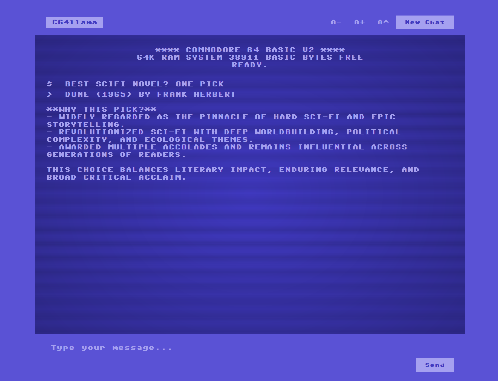

# C64llama

A Commodore 64 BASIC-style chat interface for Ollama with authentic retro aesthetics. Features CRT scanlines, C64 color palette, and BASIC boot screen. Default model: `qwen3:4B`.



## Prerequisites

- Python 3.8+
- Ollama installed and running locally

## Installation

1. **Create and activate virtual environment:**
   ```bash
   python -m venv .venv
   .venv\Scripts\activate  # Windows
   source .venv/bin/activate  # macOS/Linux
   ```

2. **Install dependencies:**
   ```bash
   pip install -r requirements.txt
   ```

3. **Run migrations:**
   ```bash
   python manage.py migrate
   ```

4. **Start the server:**
   ```bash
   python manage.py runserver
   ```

5. **Access the application:**
   Open `http://127.0.0.1:8000/` in your browser.

## Features

- Authentic C64 blue background and light blue text
- CRT scanline effects and vignette glow
- BASIC V2 boot screen with "READY." prompt
- Pixel-perfect monospace font rendering
- Font size controls and uppercase toggle
- Chat history export

## Optional Enhancement

For authentic C64 font, download C64 Pro Mono from https://style64.org/c64-truetype and place `C64_Pro_Mono-STYLE.ttf` in `chat/static/chat/fonts/`.

## License

MIT License

Copyright (c) 2025 The C64llama Project Contributors

Permission is hereby granted, free of charge, to any person obtaining a copy
of this software and associated documentation files (the "Software"), to deal
in the Software without restriction, including without limitation the rights
to use, copy, modify, merge, publish, distribute, sublicense, and/or sell
copies of the Software, and to permit persons to whom the Software is
furnished to do so, subject to the following conditions:

The above copyright notice and this permission notice shall be included in all
copies or substantial portions of the Software.

THE SOFTWARE IS PROVIDED "AS IS", WITHOUT WARRANTY OF ANY KIND, EXPRESS OR
IMPLIED, INCLUDING BUT NOT LIMITED TO THE WARRANTIES OF MERCHANTABILITY,
FITNESS FOR A PARTICULAR PURPOSE AND NONINFRINGEMENT. IN NO EVENT SHALL THE
AUTHORS OR COPYRIGHT HOLDERS BE LIABLE FOR ANY CLAIM, DAMAGES OR OTHER
LIABILITY, WHETHER IN AN ACTION OF CONTRACT, TORT OR OTHERWISE, ARISING FROM,
OUT OF OR IN CONNECTION WITH THE SOFTWARE OR THE USE OR OTHER DEALINGS IN THE
SOFTWARE.
